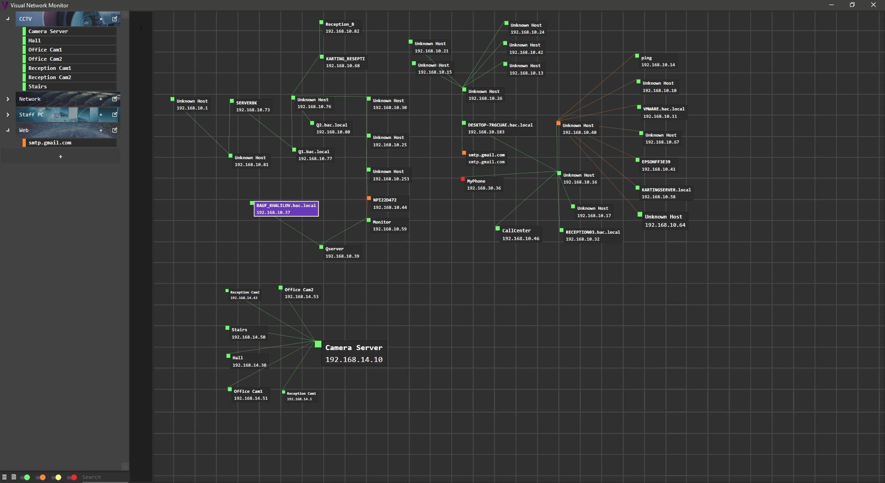
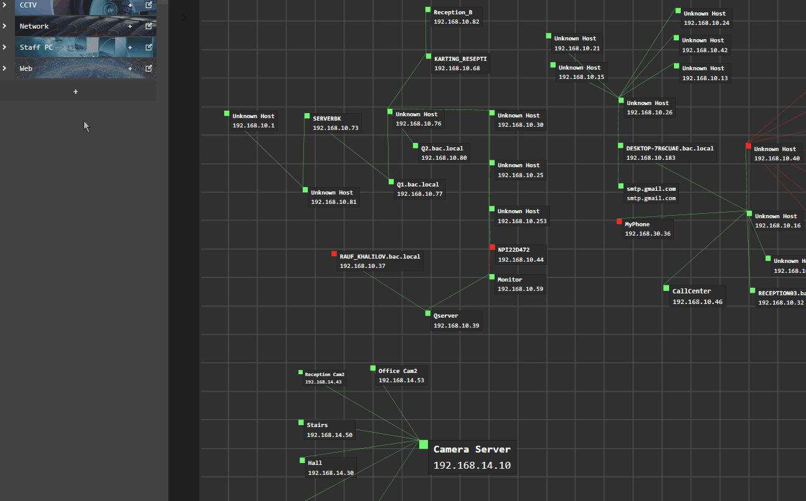
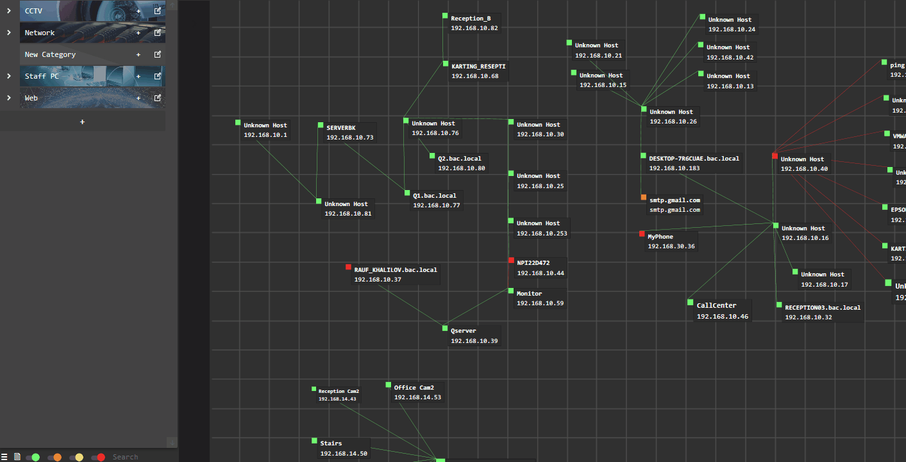
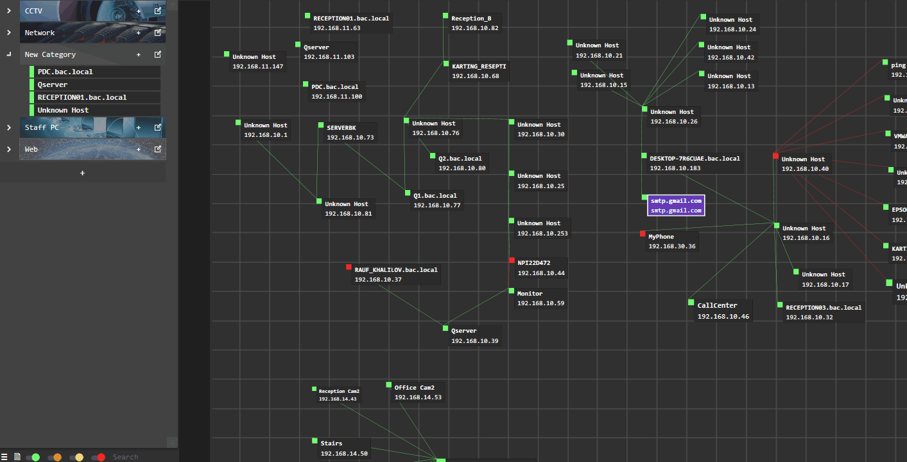
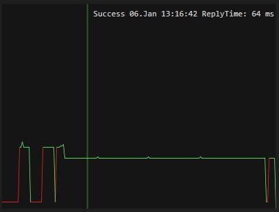
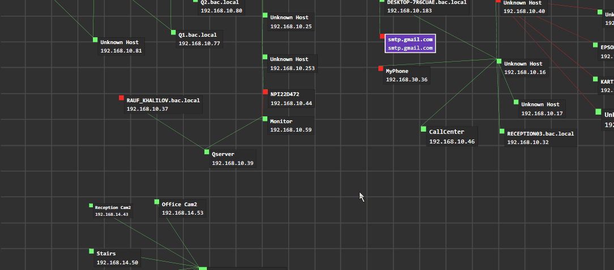
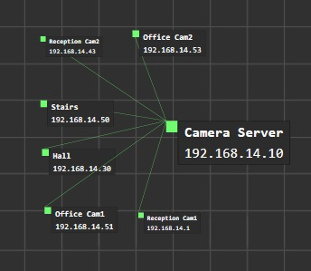
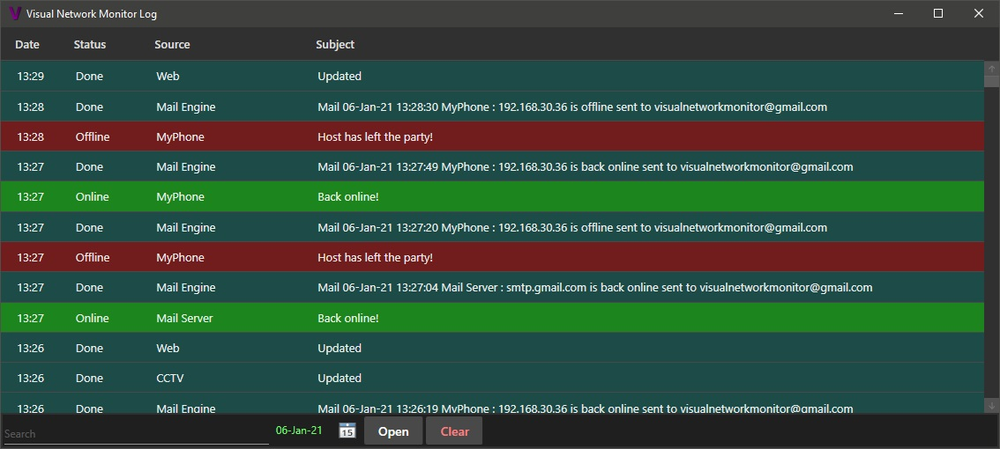

# **Visual Network Monitor**
### Keep an eye on your network!

[Download Portable Build](bin/Debug/VNMPortable.rar)

#### Functionality:
* Easy Networking administrative tool to track over ICMP and get notifications about availability and changes of network hosts. 
* Includes interactive map function, which allows you to upload your custom map and place visual representation of hosts on it.
* Custom statistics graph for each host.
* Minimal system and network load.
* Tested with more than 500 hosts one time.

## Overview:

* To add new category press "+" button on the host list on left side

* To edit category name or icon or remove it hit "edit" button on prefered category
  * To add new icons to icon list move prefered images to /Icons folder and restart the program
* To add new host press "+" button on prefered category
   * To add single host enter address, name and choose prefered update delay
   * To add scan and add range of hosts hit "Add Range" tab in "New Host" window
     * Enter needed range, start scan and then select prefered hosts and hit "Add" button
     

* To remove or edit host hit on expander on the right side of the hosts list
* Move mouse on live graph to check last actions

* By default new hosts appears on left top corner of the map
   * You can move them with mouse in borders of your map
   * To change scale of selected host hold "ctrl" and use mouse scroll wheel
   * To select parent host hold "ctrl" and hit on other host with mouse left button
   * To reset parent host hold "ctrl" and hit on selected host with mouse left button   
* You can control map with mouse
  * Hold "Alt" while scrolling on map to change opacity

* Hit settings button on bottom left corner to open settings window
 * Enter mail settings and hit "Test Mail Settings" button to test you mail connection to get notifications
 * Grab your map to /Maps folder, restart the software and you'll see it apears in "Choose Map" section
  * After map change you will be asked about changing map positions of hosts because some of them could be out of new maps size
* Select "Clear Actions on Quit" option to remove extra actions stored while work _(200 actions will remain)_

* Hit "Log Window" button on left bottom corner to open log window
  * Use search bar or column sort to navigate
  * Choose prefered date and hit "Open" button to view log file
  

